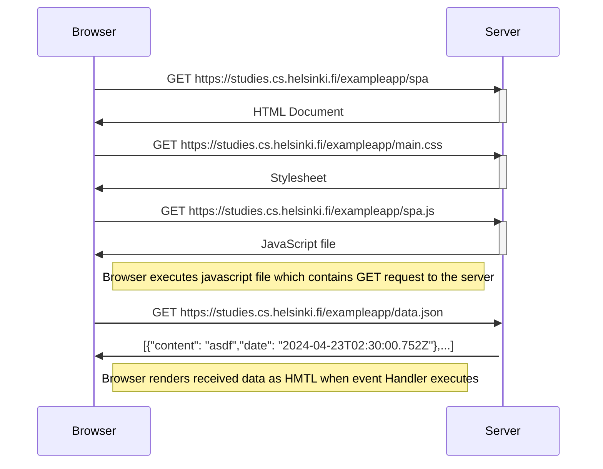

```mermaid

sequenceDiagram
participant b as Browser
participant s as Server
b->>s: GET https://studies.cs.helsinki.fi/exampleapp/spa
activate s
s->>b: HTML Document
deactivate s
b->>s: GET https://studies.cs.helsinki.fi/exampleapp/main.css
activate s
s->>b: Stylesheet
deactivate s
b->>s: GET https://studies.cs.helsinki.fi/exampleapp/spa.js
activate s
s->>b: JavaScript file
deactivate s
Note right of b: Browser executes javascript file which contains GET request to the server
b->>s: GET https://studies.cs.helsinki.fi/exampleapp/data.json
activate s
s->>b: [{"content": "asdf","date": "2024-04-23T02:30:00.752Z"},...]
Note right of b: Browser renders received data as HMTL when event Handler executes

```
