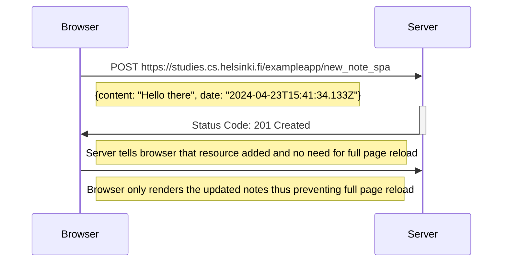

```mermaid
sequenceDiagram
participant b as Browser
participant s as Server

b->>s: POST https://studies.cs.helsinki.fi/exampleapp/new_note_spa
Note right of b: {content: "Hello there", date: "2024-04-23T15:41:34.133Z"}
activate s
s->>b: Status Code: 201 Created
deactivate s
Note right of b: Server tells browser that resource added and no need for full page reload
b->>s: 
Note right of b: Browser only renders the updated notes thus preventing full page reload

```